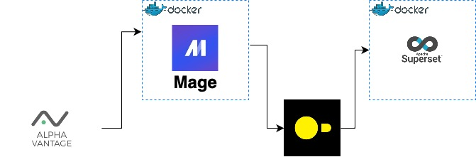
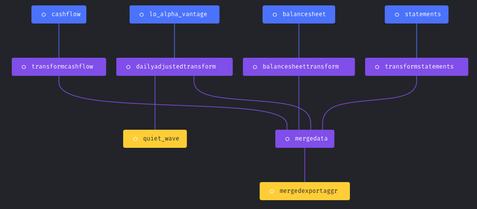
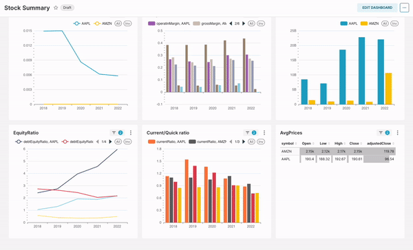

# Stocks-Crypto ETL|Data Engineering Project

The project aims to shows how to build an End-to-End data pipeline (ETL) and perform basic data analytics on a couple of stocks, ETFs and crypto (which I currently hold) while testing out cool technologies like Mage, DuckDB and Apache Superset.

## Data Sources
The Mage-AI Stocks Project uses data from Alpha Vantage. \
Access keys can be created by following the Alpha Vantage docs: https://www.alphavantage.co

## Data Stack

Mage-ai -> For data pipeline development and orchestration (Get info [here](https://www.mage.ai))

DuckDB -> For data storage (Find more [here](https://duckdb.org))

Visualizations -> Apache Superset (More info [here](https://superset.apache.org))

Contenerization -> Docker

Language -> Python

## Pipeline
The data pipeline consists of the following steps:

1.  Connect to the Alpha Vantage API using the access keys
2.  Retrieve several finance data (Income statement, Cash flow etatement, Balance Sheet, Daily share prices) from the API
3.  Process the data using Mage-AI
4.  Save the processed data in Duck DB (aka Poor's man Data Warehouse)

A flowchart of the pipeline is shown below:

This is how it looks in Mage.
However, to avoid issues with limited calls from API i have break it down in 5 pipelines.
So, first I save the data in 4 separate tables and then merge them to one big table.

## Setup
To set up the project, follow these steps:

1.  Clone the repository and navigate to the project directory
2.  Build/Start the Docker container using Make mageBuild -> Make mageStart
-   For local development create conda environment
-   activate conda environment by calling *conda activate mage_finace*
3.  Run the pipeline -> This will save the results in duckDB
4.  Clone the Apache Superset repository
5.  To mount the duckDB file in Apache Superset navigate to the corresponding repo
and inside the ***docker-compose-non-dev.yml*** under ***x-superset-volumes: &superset-volumes*** copy the duckDB path in the **app** container
eg. - /{full path}/stockapp.duckdb:/app/stockapp.duckdb
6.  In Make file change the path of the Apache Superset where ***docker-compose-non-dev.yml*** is located (in your local superset repo)
7.  Fire up Apache superset by using Make supersetUP
8.  To succesfully run duckDB in Apache Superset do the following:
- Get the **super_app** container ID (you can docker ps to see the running containers)
- Then run docker exec -it **dockerId** sh -c "pip install duckdb_engine"

**!NOTE** probably I could have simplified the steps above by adding everything in docker-compose file :)
Also the Apache superset configuration to be able to run DuckDB was the most challenging part

## Running the Pipeline
To run the pipeline, follow these steps:

1.  Access the Mage-AI web interface at http://localhost:6789/
2.  Click on the "stockProject" pipeline
- You may want to run the individual ones to avoid errors from API
3.  Click on "Run pipeline now" and "Run now"
4.  Enter the trigger and check the pipeline result

## Dashboard Apache Superset

Work in progress of the dashboard is shown below

## Improvements

- Add more tests
- Add more data quality checks
- Implement CI/CD with Github Actions
